# Sistema de Adopción de Animales - Arquitectura de Microservicios

## Diagrama de Arquitectura

```mermaid
graph TB
    %% --- USUARIOS ---
    subgraph USERS ["👥 Usuarios"]
        U1["👤 Cliente HTTP"]
    end

    %% --- API GATEWAY ---
    subgraph GATEWAY ["🌐 ms-gateway :3000"]
        direction TB
        GW_APP["AppModule"]
        GW_ANIMAL["AnimalModule<br/>POST /animals"]
        GW_ADOPT["AdoptionModule<br/>POST /adoptions"]
    end

    %% --- RABBITMQ ---
    subgraph RABBIT ["🐇 RabbitMQ :5672"]
        Q_ANIMAL["📬 animal_queue"]
        Q_ADOPT["📬 adoption_queue"]
    end

    %% --- MS ADOPTION ---
    subgraph MS_ADOPTION ["📝 ms-adoption :3002"]
        direction TB
        ADOPT_CTRL["AdoptionController<br/>@EventPattern"]
        ADOPT_SVC["AdoptionService"]
        IDEMP_GUARD["IdempotencyGuard"]
    end

    %% --- MS ANIMAL ---
    subgraph MS_ANIMAL ["🐾 ms-animal :3001"]
        direction TB
        ANI_CONSUMER["AnimalConsumer<br/>@EventPattern"]
        ANI_SVC["AnimalService"]
        ANI_CTRL["AppController<br/>GET /animals"]
    end

    %% --- INFRAESTRUCTURA ---
    subgraph INFRA ["🏗️ Infraestructura"]
        REDIS["⚡ Redis :6379<br/>Cache Idempotencia"]
        DB_ADOPT["💾 PostgreSQL :5433<br/>adoption_db"]
        DB_ANIMAL["💾 PostgreSQL :5434<br/>animal_db"]
    end

    %% --- FLUJOS ---
    
    %% Usuario al Gateway
    U1 -->|"HTTP"| GATEWAY

    %% Gateway a RabbitMQ
    GW_ANIMAL -->|"emit('animal.create')"| Q_ANIMAL
    GW_ADOPT -->|"emit('adoption.request')"| Q_ADOPT

    %% RabbitMQ a Microservicios
    Q_ADOPT -.->|"consume"| ADOPT_CTRL
    Q_ANIMAL -.->|"consume"| ANI_CONSUMER

    %% Flujo interno MS Adoption
    ADOPT_CTRL --> IDEMP_GUARD
    IDEMP_GUARD -->|"SETNX"| REDIS
    IDEMP_GUARD --> ADOPT_SVC
    ADOPT_SVC -->|"INSERT"| DB_ADOPT
    ADOPT_SVC -->|"emit('adoption.created')"| Q_ANIMAL

    %% Flujo interno MS Animal
    ANI_CONSUMER --> ANI_SVC
    ANI_SVC -->|"CRUD"| DB_ANIMAL

    %% Usuario consulta animales
    U1 -->|"GET /animals"| ANI_CTRL
    ANI_CTRL --> ANI_SVC

    %% --- ESTILOS ---
    classDef gateway fill:#e67e22,stroke:#d35400,stroke-width:2px,color:#fff
    classDef microservice fill:#3498db,stroke:#2980b9,stroke-width:2px,color:#fff
    classDef queue fill:#e74c3c,stroke:#c0392b,stroke-width:2px,color:#fff
    classDef db fill:#27ae60,stroke:#229954,stroke-width:2px,color:#fff
    classDef cache fill:#9b59b6,stroke:#8e44ad,stroke-width:2px,color:#fff

    class GATEWAY gateway
    class MS_ADOPTION,MS_ANIMAL microservice
    class Q_ANIMAL,Q_ADOPT queue
    class DB_ADOPT,DB_ANIMAL db
    class REDIS cache
```



## Diagrama de Secuencia - Flujo de Adopción

```mermaid
sequenceDiagram
    autonumber
    participant U as 👤 Usuario
    participant GW as 🌐 Gateway
    participant RMQ as 🐇 RabbitMQ
    participant ADOPT as 📝 ms-adoption
    participant REDIS as ⚡ Redis
    participant DB_A as 💾 adoption_db
    participant ANI as 🐾 ms-animal
    participant DB_N as 💾 animal_db

    U->>GW: POST /adoptions {animal_id, adopter_name}
    GW->>GW: Genera message_id (UUID)
    GW-->>U: 202 Accepted {message_id}
    GW->>RMQ: emit('adoption.request', {message_id, data})
    
    RMQ->>ADOPT: consume mensaje
    ADOPT->>REDIS: SET idempotency:{message_id} NX EX 86400
    
    alt Mensaje Nuevo (OK)
        REDIS-->>ADOPT: OK
        ADOPT->>DB_A: INSERT adoption
        ADOPT->>RMQ: emit('adoption.created', {animal_id})
        RMQ->>ANI: consume mensaje
        ANI->>DB_N: UPDATE animal SET adopted=true
        ANI->>RMQ: ACK ✓
    else Mensaje Duplicado (null)
        REDIS-->>ADOPT: null
        ADOPT->>ADOPT: Ignorar (ya procesado)
    end
    
    ADOPT->>RMQ: ACK ✓
```



## Diagrama de Secuencia - Crear Animal


## Descripción de Componentes

### 1. **API Gateway** (Puerto 3000)
- **Responsabilidad**: Punto de entrada HTTP para clientes externos
- **Tecnología**: NestJS con ClientProxy de RabbitMQ
- **Estructura Modular**:
  - `AnimalModule` → `AnimalController` → `POST /animals`
  - `AdoptionModule` → `AdoptionController` → `POST /adoptions`
- **Función**: Recibe solicitudes HTTP y las publica como eventos en RabbitMQ

### 2. **MS Adoption** (Puerto 3002)
- **Responsabilidad**: Gestión de adopciones con garantía de idempotencia
- **Tecnología**: NestJS + TypeORM + PostgreSQL
- **Estructura**:
  - `adoption/` → Controlador, Servicio y Entidad de Adopción
  - `idempotency/` → Guard, Service y Entity para control de duplicados
- **Base de Datos**: PostgreSQL (adoption_db) en puerto 5433
- **Eventos**: 
  - Consume: `adoption.request` desde `adoption_queue`
  - Publica: `adoption.created` hacia `animal_queue`

### 3. **MS Animal** (Puerto 3001)
- **Responsabilidad**: Gestión del ciclo de vida de animales
- **Tecnología**: NestJS + TypeORM
- **Estructura**:
  - `animal/` → Consumer, Service y Entity
- **Funciones**:
  - Crear animales nuevos (con idempotencia por nombre+especie)
  - Marcar animales como adoptados
- **Base de Datos**: PostgreSQL (animal_db) en puerto 5434
- **Eventos**: 
  - Consume: `animal.create` desde `animal_queue` (creación)
  - Consume: `adoption.created` desde `animal_queue` (actualización estado)

### 4. **RabbitMQ** (Puertos 5672, 15672)
- **Responsabilidad**: Message broker para comunicación asíncrona
- **Colas**:
  - `adoption_queue`: Para eventos `adoption.request`
  - `animal_queue`: Para eventos `animal.create` y `adoption.created`
- **Características**: ACK manual, colas durables

### 5. **PostgreSQL**
- **adoption_db** (Puerto 5433): Almacena adopciones + tabla de idempotencia
- **animal_db** (Puerto 5434): Almacena información y estado de animales

## Flujos del Sistema

### Flujo 1: Crear Animal
1. **Usuario** envía `POST /animals` con `{name, species}` al **Gateway**
2. **Gateway** (AnimalController) genera UUID y publica `animal.create` en `animal_queue`
3. **MS Animal** consume el evento
4. Verifica idempotencia (nombre+especie únicos)
5. Si es nuevo → crea animal en PostgreSQL
6. ACK del mensaje

### Flujo 2: Solicitar Adopción
1. **Usuario** envía `POST /adoptions` con `{animal_id, adopter_name}` al **Gateway**
2. **Gateway** (AdoptionController) genera UUID y publica `adoption.request` en `adoption_queue`
3. **MS Adoption** consume el evento
4. **IdempotencyGuard** verifica si el message_id ya fue procesado
5. Si es nuevo:
   - Guarda message_id en tabla de idempotencia
   - Crea registro de adopción en PostgreSQL
   - Publica `adoption.created` hacia `animal_queue`
6. **MS Animal** consume `adoption.created`
7. Verifica si el animal ya está adoptado (idempotencia)
8. Si no → actualiza estado a "adoptado"
9. ACK del mensaje

## Características Clave

- ✅ **Idempotencia Multinivel**: 
  - En MS Adoption: Por message_id (tabla idempotency)
  - En MS Animal: Por lógica de negocio (estado del animal)
- ✅ **Comunicación Asíncrona**: Desacoplamiento mediante RabbitMQ
- ✅ **Gateway Modular**: Controladores separados por dominio
- ✅ **Separación de Responsabilidades**: Cada microservicio con su propia BD
- ✅ **ACK Manual**: Garantiza procesamiento completo antes de confirmar
- ✅ **Event-Driven Architecture**: Comunicación basada en eventos de dominio

## Tecnologías Utilizadas

- **Framework**: NestJS
- **Lenguaje**: TypeScript
- **Message Broker**: RabbitMQ 3.11
- **Base de Datos**: PostgreSQL 17
- **ORM**: TypeORM
- **Containerización**: Docker Compose

## Endpoints

- **Gateway**: http://localhost:3000
  - `POST /animals` - Crear animal
  - `POST /adoptions` - Solicitar adopción
- **MS Animal**: http://localhost:3001
  - `GET /animals` - Listar animales
- **MS Adoption**: http://localhost:3002
- **RabbitMQ Management**: http://localhost:15672 (guest/guest)

## Ejecución

```bash
# Levantar infraestructura
docker-compose up -d

# Instalar dependencias (en cada microservicio)
cd ms-gateway && npm install
cd ms-adoption && npm install
cd ms-animal && npm install

# Ejecutar microservicios (cada uno en terminal separada)
cd ms-gateway && npm run start:dev    # Puerto 3000
cd ms-adoption && npm run start:dev   # Puerto 3002
cd ms-animal && npm run start:dev     # Puerto 3001
```

## Pruebas

```bash
# Crear un animal
curl -X POST http://localhost:3000/animals \
  -H "Content-Type: application/json" \
  -d '{"name": "Luna", "species": "Perro"}'

# Solicitar adopción
curl -X POST http://localhost:3000/adoptions \
  -H "Content-Type: application/json" \
  -d '{"animal_id": "<UUID_DEL_ANIMAL>", "adopter_name": "Juan"}'

# Ver animales
curl http://localhost:3001/animals
```
