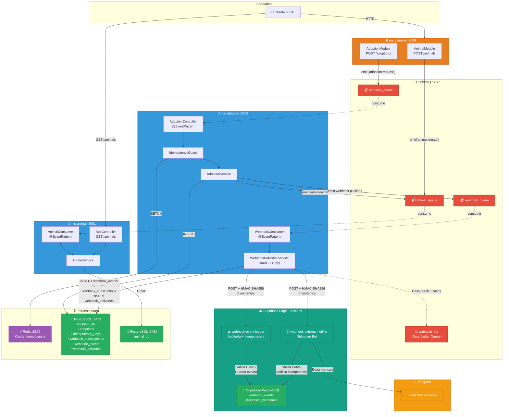

# Sistema de Adopción de Animales - Arquitectura de Microservicios

## Diagrama de Arquitectura

```mermaid
graph TB
    %% --- USUARIOS ---
    subgraph USERS ["👥 Usuarios"]
        U1["👤 Cliente HTTP"]
    end

    %% --- API GATEWAY ---
    subgraph GATEWAY ["🌐 ms-gateway :3000"]
        direction TB
        GW_ANIMAL["AnimalModule<br/>POST /animals"]
        GW_ADOPT["AdoptionModule<br/>POST /adoptions"]
    end

    %% --- RABBITMQ ---
    subgraph RABBIT ["🐇 RabbitMQ :5672"]
        Q_ANIMAL["📬 animal_queue"]
        Q_ADOPT["📬 adoption_queue"]
        Q_WEBHOOK["📬 webhook_queue"]
        Q_DLQ["☠️ webhook_dlq<br/>(Dead Letter Queue)"]
    end

    %% --- MS ADOPTION ---
    subgraph MS_ADOPTION ["📝 ms-adoption :3002"]
        direction TB
        ADOPT_CTRL["AdoptionController<br/>@EventPattern"]
        ADOPT_SVC["AdoptionService"]
        IDEMP_GUARD["IdempotencyGuard"]
        WH_CONSUMER["WebhookConsumer<br/>@EventPattern"]
        WH_PUBLISHER["WebhookPublisherService<br/>HMAC + Retry"]
    end

    %% --- MS ANIMAL ---
    subgraph MS_ANIMAL ["🐾 ms-animal :3001"]
        direction TB
        ANI_CONSUMER["AnimalConsumer<br/>@EventPattern"]
        ANI_SVC["AnimalService"]
        ANI_CTRL["AppController<br/>GET /animals"]
    end

    %% --- SUPABASE EDGE FUNCTIONS ---
    subgraph SUPABASE ["☁️ Supabase Edge Functions"]
        direction TB
        EF_LOGGER["📊 webhook-event-logger<br/>Auditoría + Idempotencia"]
        EF_NOTIFIER["📱 webhook-external-notifier<br/>Telegram Bot"]
        SB_DB["💾 Supabase PostgreSQL<br/>webhook_events<br/>processed_webhooks"]
    end

    %% --- TELEGRAM ---
    subgraph TELEGRAM ["💬 Telegram"]
        TG_BOT["🤖 Bot Notificaciones"]
    end

    %% --- INFRAESTRUCTURA ---
    subgraph INFRA ["🏗️ Infraestructura"]
        REDIS["⚡ Redis :6379<br/>Cache Idempotencia"]
        DB_ADOPT["💾 PostgreSQL :5433<br/>adoption_db<br/>• adoptions<br/>• idempotency_keys<br/>• webhook_subscriptions<br/>• webhook_events<br/>• webhook_deliveries"]
        DB_ANIMAL["💾 PostgreSQL :5434<br/>animal_db"]
    end

    %% --- FLUJOS PRINCIPALES ---
    
    %% Usuario al Gateway
    U1 -->|"HTTP"| GATEWAY

    %% Gateway a RabbitMQ
    GW_ANIMAL -->|"emit('animal.create')"| Q_ANIMAL
    GW_ADOPT -->|"emit('adoption.request')"| Q_ADOPT

    %% RabbitMQ a Microservicios
    Q_ADOPT -.->|"consume"| ADOPT_CTRL
    Q_ANIMAL -.->|"consume"| ANI_CONSUMER

    %% Flujo interno MS Adoption
    ADOPT_CTRL --> IDEMP_GUARD
    IDEMP_GUARD -->|"SETNX"| REDIS
    IDEMP_GUARD --> ADOPT_SVC
    ADOPT_SVC -->|"INSERT"| DB_ADOPT
    ADOPT_SVC -->|"emit('adoption.created')"| Q_ANIMAL
    
    %% NUEVO: Flujo de Webhooks
    ADOPT_SVC -->|"emit('webhook.publish')"| Q_WEBHOOK
    Q_WEBHOOK -.->|"consume"| WH_CONSUMER
    WH_CONSUMER --> WH_PUBLISHER
    WH_PUBLISHER -->|"INSERT webhook_events<br/>SELECT webhook_subscriptions<br/>INSERT webhook_deliveries"| DB_ADOPT
    WH_PUBLISHER -->|"POST + HMAC-SHA256<br/>6 reintentos"| EF_LOGGER
    WH_PUBLISHER -->|"POST + HMAC-SHA256<br/>6 reintentos"| EF_NOTIFIER
    WH_PUBLISHER -.->|"Después de 6 fallos"| Q_DLQ
    
    %% Edge Functions
    EF_LOGGER -->|"Valida HMAC<br/>Guarda evento"| SB_DB
    EF_NOTIFIER -->|"Valida HMAC<br/>Verifica idempotencia"| SB_DB
    EF_NOTIFIER -->|"Envía mensaje"| TG_BOT

    %% Flujo interno MS Animal
    ANI_CONSUMER --> ANI_SVC
    ANI_SVC -->|"CRUD"| DB_ANIMAL

    %% Usuario consulta animales
    U1 -->|"GET /animals"| ANI_CTRL
    ANI_CTRL --> ANI_SVC

    %% --- ESTILOS ---
    classDef gateway fill:#e67e22,stroke:#d35400,stroke-width:2px,color:#fff
    classDef microservice fill:#3498db,stroke:#2980b9,stroke-width:2px,color:#fff
    classDef queue fill:#e74c3c,stroke:#c0392b,stroke-width:2px,color:#fff
    classDef db fill:#27ae60,stroke:#229954,stroke-width:2px,color:#fff
    classDef cache fill:#9b59b6,stroke:#8e44ad,stroke-width:2px,color:#fff
    classDef serverless fill:#16a085,stroke:#138d75,stroke-width:2px,color:#fff
    classDef external fill:#f39c12,stroke:#e67e22,stroke-width:2px,color:#fff

    class GATEWAY gateway
    class MS_ADOPTION,MS_ANIMAL microservice
    class Q_ANIMAL,Q_ADOPT,Q_WEBHOOK,Q_DLQ queue
    class DB_ADOPT,DB_ANIMAL,SB_DB db
    class REDIS cache
    class SUPABASE,EF_LOGGER,EF_NOTIFIER serverless
    class TELEGRAM,TG_BOT external
```

