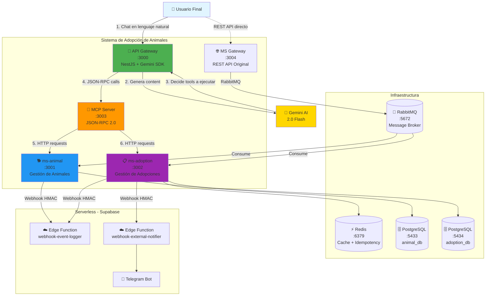
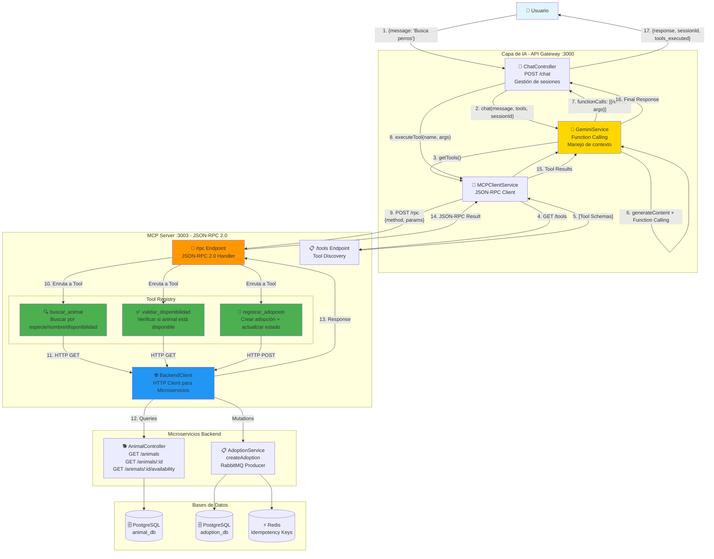

# 🐾 Sistema de Microservicios con MCP, Webhooks y AI

## 📋 Arquitectura Event-Driven con Model Context Protocol (MCP) + Gemini AI

Sistema inteligente de gestión de adopción de animales implementado con:
- **Model Context Protocol (MCP)** - Protocolo estándar para integración con LLMs
- **Gemini AI 2.0 Flash** - IA generativa con Function Calling
- **Microservicios** (NestJS) - Arquitectura modular y escalable
- **RabbitMQ** (Mensajería asíncrona) - Comunicación entre servicios
- **Redis** (Idempotencia y cache) - Prevención de duplicados
- **Webhooks** (Notificaciones en tiempo real) - Event-driven architecture
- **Supabase Edge Functions** (Serverless computing) - Procesamiento serverless
- **Telegram Bot** (Notificaciones externas) - Alertas en tiempo real

---

## 🏗️ Diagrama C4 - Nivel 1: Sistema Completo



**Explicación del flujo:**
1. 👤 Usuario escribe en lenguaje natural: *"Quiero adoptar un perro"*
2. 🤖 Gemini AI analiza y decide qué herramientas (tools) ejecutar
3. 🔧 MCP Server expone 3 tools: `buscar_animal`, `validar_disponibilidad`, `registrar_adopcion`
4. 🐕 Microservicios procesan las operaciones y actualizan bases de datos
5. ☁️ Webhooks notifican eventos a Edge Functions serverless
6. 💬 Telegram Bot envía notificaciones en tiempo real

---

## 🤖 Diagrama C4 - Nivel 1: Arquitectura MCP



**Componentes clave del MCP:**

1. **API Gateway** - Orquestador de IA
   - Integra Gemini AI con Function Calling
   - Mantiene contexto de conversación (sessionId)
   - Traduce respuestas de herramientas a lenguaje natural

2. **MCP Server** - Protocolo JSON-RPC 2.0
   - Expone herramientas como funciones ejecutables
   - Discovery endpoint (`/tools`) para schemas
   - Execution endpoint (`/rpc`) para llamadas

3. **Tool Registry** - 3 Herramientas principales
   - `buscar_animal`: Query flexible con filtros
   - `validar_disponibilidad`: Verificación en tiempo real
   - `registrar_adopcion`: Transacción completa con idempotencia

4. **Backend Client** - Adaptador HTTP
   - Convierte llamadas MCP a REST API
   - Maneja errores y timeouts
   - Abstrae comunicación con microservicios

---

## 🚀 Inicio Rápido

### 1. Prerrequisitos

- Node.js (v18+)
- Docker & Docker Compose
- Supabase CLI (opcional, para Edge Functions)
- Cuenta en Supabase (opcional)
- **Gemini API Key** (obligatorio para MCP) → https://aistudio.google.com/app/apikey
- Bot de Telegram (opcional)

### 2. Configurar Gemini API Key

```powershell
# Crear archivo .env en api-gateway/
cd api-gateway
echo "GEMINI_API_KEY=tu-api-key-aqui" > .env
```

⚠️ **IMPORTANTE**: Habilita facturación en Google Cloud para evitar límites de cuota (gemini-2.0-flash sigue siendo gratis).

### 3. Levantar Infraestructura

```powershell
# Levantar servicios Docker (PostgreSQL, RabbitMQ, Redis)
docker-compose up -d

# Verificar servicios
docker ps
```

### 4. Instalar Dependencias

```powershell
# API Gateway con Gemini
cd api-gateway
npm install

# MCP Server
cd ../mcp-server
npm install

# Gateway original
cd ../ms-gateway
npm install

# Animal
cd ../ms-animal
npm install

# Adoption
cd ../ms-adoption
npm install
```

### 5. Iniciar Todos los Servicios

Abre **5 terminales**:

```powershell
# Terminal 1 - API Gateway con Gemini AI
cd api-gateway
npm run start:dev

# Terminal 2 - MCP Server
cd mcp-server
npm run dev

# Terminal 3 - ms-animal
cd ms-animal
npm run start:dev

# Terminal 4 - ms-adoption
cd ms-adoption
npm run start:dev

# Terminal 5 - ms-gateway (opcional, REST tradicional)
cd ms-gateway
npm run start:dev
```

---

## 🧪 Pruebas con IA - Flujo MCP + Gemini

### 1. Conversación Natural - Buscar Animales

```powershell
curl -X POST http://localhost:3000/chat `
  -H "Content-Type: application/json" `
  -d '{
    "message": "Hola, que animales hay disponibles?"
  }'
```

**Respuesta esperada:**
```json
{
  "response": "Tenemos estos animales disponibles:\n- jiko (reptil)\n- gorila (mamífero)\n- gusanoo (insecto)\n¿Te interesa alguno?",
  "sessionId": "c72840b9-071b-4676-b3ea-0e2c1f07e57",
  "tools_executed": [
    {
      "tool": "buscar_animal",
      "args": {},
      "result": {
        "success": true,
        "count": 17,
        "animals": [...]
      }
    }
  ]
}
```

### 2. Adoptar con Contexto - Usar sessionId

```powershell
# Guarda el sessionId de la respuesta anterior
curl -X POST http://localhost:3000/chat `
  -H "Content-Type: application/json" `
  -d '{
    "message": "Quiero adoptar al gorila, mi nombre es Juan",
    "sessionId": "c72840b9-071b-4676-b3ea-0e2c1f07e57"
  }'
```

**Respuesta esperada:**
```json
{
  "response": "¡Excelente! He registrado la adopción del gorila a nombre de Juan. La adopción ha sido completada exitosamente.",
  "sessionId": "c72840b9-071b-4676-b3ea-0e2c1f07e57",
  "tools_executed": [
    {
      "tool": "validar_disponibilidad",
      "args": {"animal_id": "69789994-2cd4-485d-bf5a-873de734a64d"},
      "result": {"available": true}
    },
    {
      "tool": "registrar_adopcion",
      "args": {
        "animal_id": "69789994-2cd4-485d-bf5a-873de734a64d",
        "adopter_name": "Juan"
      },
      "result": {
        "success": true,
        "adoption_id": "...",
        "animal_name": "gorila"
      }
    }
  ]
}
```

### 3. Adopción Directa por Nombre

```powershell
curl -X POST http://localhost:3000/chat `
  -H "Content-Type: application/json" `
  -d '{
    "message": "Busca perros disponibles"
  }'

# Luego con el sessionId:
curl -X POST http://localhost:3000/chat `
  -H "Content-Type: application/json" `
  -d '{
    "message": "Quiero adoptar a Firulais, soy Pedro",
    "sessionId": "EL-SESSIONID-ANTERIOR"
  }'
```

**Ventajas del flujo con IA:**
- ✅ Conversación natural sin endpoints complejos
- ✅ Gemini decide qué herramientas ejecutar automáticamente
- ✅ Contexto de conversación preservado con sessionId
- ✅ Usuario no necesita saber IDs de animales
- ✅ Validaciones automáticas antes de adoptar

---

## 🔧 Pruebas REST Tradicionales (sin IA)

### Crear Animal (ms-gateway)

```powershell
curl -X POST http://localhost:3004/animals `
  -H "Content-Type: application/json" `
  -d '{"name":"Firulais","species":"Dog"}'
```

**Resultado esperado:**
- ✅ Animal creado en base de datos
- ✅ Webhook enviado a Edge Functions
- ✅ Notificación recibida en Telegram

### Crear Adopción (ms-gateway)

```powershell
curl -X POST http://localhost:3004/adoptions `
  -H "Content-Type: application/json" `
  -d '{"animal_id":"<animal-id>","adopter_name":"Juan Perez"}'
```

### Probar Idempotencia

```powershell
# Ejecutar 3 veces el mismo comando
for ($i=1; $i -le 3; $i++) {
  curl -X POST http://localhost:3004/animals `
    -H "Content-Type: application/json" `
    -H "Idempotency-Key: test-key-123" `
    -d '{"name":"Rex","species":"Cat"}'
  Start-Sleep -Seconds 2
}
```

**Verificar:**
- Solo 1 animal creado
- Solo 1 webhook en Supabase
- Solo 1 notificación en Telegram

---

## 📊 URLs Importantes

| Servicio | Puerto | URL | Descripción |
|----------|--------|-----|-------------|
| **API Gateway (IA)** | 3000 | http://localhost:3000/chat | Chat con Gemini AI |
| **API Gateway Health** | 3000 | http://localhost:3000/health | Health check |
| **MCP Server** | 3003 | http://localhost:3003/tools | MCP Tool Discovery |
| **MCP Server RPC** | 3003 | http://localhost:3003/rpc | JSON-RPC 2.0 Endpoint |
| **ms-animal** | 3001 | http://localhost:3001/animals | Gestión de animales |
| **ms-adoption** | 3002 | http://localhost:3002/adoptions | Gestión de adopciones |
| **ms-gateway (REST)** | 3004 | http://localhost:3004/* | API REST tradicional |
| **RabbitMQ Management** | 15672 | http://localhost:15672 | UI Admin (guest/guest) |
| **PostgreSQL animal_db** | 5433 | localhost:5433 | Base de datos animales |
| **PostgreSQL adoption_db** | 5434 | localhost:5434 | Base de datos adopciones |
| **Redis** | 6379 | localhost:6379 | Cache + Idempotency |

**Supabase (opcional):**
- **Dashboard:** https://supabase.com/dashboard
- **Edge Function 1:** https://ovibmkajyvhzeoxtxxxh.supabase.co/functions/v1/webhook-event-logger
- **Edge Function 2:** https://ovibmkajyvhzeoxtxxxh.supabase.co/functions/v1/webhook-external-notifier

---

## 🤖 MCP Tools Disponibles

### 1. `buscar_animal`

Busca animales con filtros opcionales.

**Parámetros:**
- `especie` (opcional): Filtrar por especie
- `nombre` (opcional): Filtrar por nombre
- `disponible` (opcional): true/false

**Ejemplo con curl:**
```powershell
curl -X POST http://localhost:3003/rpc `
  -H "Content-Type: application/json" `
  -d '{
    "jsonrpc": "2.0",
    "method": "buscar_animal",
    "params": {"especie": "Dog"},
    "id": 1
  }'
```

### 2. `validar_disponibilidad`

Verifica si un animal está disponible para adopción.

**Parámetros:**
- `animal_id` (requerido): UUID del animal

**Ejemplo:**
```powershell
curl -X POST http://localhost:3003/rpc `
  -H "Content-Type: application/json" `
  -d '{
    "jsonrpc": "2.0",
    "method": "validar_disponibilidad",
    "params": {"animal_id": "69789994-2cd4-485d-bf5a-873de734a64d"},
    "id": 2
  }'
```

### 3. `registrar_adopcion`

Crea una adopción y actualiza el estado del animal.

**Parámetros:**
- `animal_id` (requerido): UUID del animal
- `adopter_name` (requerido): Nombre del adoptante

**Ejemplo:**
```powershell
curl -X POST http://localhost:3003/rpc `
  -H "Content-Type: application/json" `
  -d '{
    "jsonrpc": "2.0",
    "method": "registrar_adopcion",
    "params": {
      "animal_id": "69789994-2cd4-485d-bf5a-873de734a64d",
      "adopter_name": "Juan Perez"
    },
    "id": 3
  }'
```

---

## 🛡️ Estrategias de Resiliencia Implementadas

### 1. Idempotent Consumer (Redis)

**Problema:** RabbitMQ garantiza "At-least-once delivery", causando duplicados en fallos de red.

**Solución:**
- Idempotency Key: `{event_type}:{entity_id}:{date}`
- Store en Redis con TTL de 24 horas
- Check atómico antes de procesar webhook
- Si ya existe, se ignora el mensaje

**Implementado en:** [ms-adoption/src/idempotency/](ms-adoption/src/idempotency/)

### 2. Contexto de Conversación (In-Memory)

**Problema:** Usuario menciona animales por nombre sin conocer sus IDs.

**Solución:**
- SessionId único por conversación
- Store de contexto con últimos animales mostrados
- Gemini infiere el ID del animal desde el contexto
- Limpieza automática de sesiones antiguas (1 hora)

**Implementado en:** [api-gateway/src/gemini/gemini.service.ts](api-gateway/src/gemini/gemini.service.ts)

### 3. Webhook Retry Strategy

**Problema:** Edge Functions pueden fallar temporalmente.

**Solución:**
- Exponential backoff (1s, 2s, 4s)
- Máximo 3 reintentos
- Dead Letter Queue para fallos permanentes
- Logging detallado de intentos

**Implementado en:** [ms-adoption/src/webhook/webhook.service.ts](ms-adoption/src/webhook/webhook.service.ts)

### 4. HMAC-SHA256 Signature Verification

**Problema:** Webhooks pueden ser falsificados.

**Solución:**
- Header `X-Webhook-Signature` con HMAC-SHA256
- Secret compartido entre emisor y receptor
- Verificación antes de procesar payload
- Rechazo de webhooks inválidos

**Implementado en:** [ms-adoption/src/webhook/webhook-security.service.ts](ms-adoption/src/webhook/webhook-security.service.ts)

---

## 📁 Estructura del Proyecto

```
practicaweb-resilencia/
├── docker-compose.yml           # PostgreSQL, RabbitMQ, Redis
├── README.md                    # Este archivo
├── taller_3_mcp.md             # Especificación del proyecto MCP
│
├── api-gateway/                 # 🤖 Gateway con Gemini AI
│   ├── .env                     # GEMINI_API_KEY
│   ├── src/
│   │   ├── main.ts              # Puerto 3000
│   │   ├── gemini/
│   │   │   └── gemini.service.ts  # Integración Gemini + Function Calling
│   │   ├── mcp-client/
│   │   │   └── mcp-client.service.ts  # Cliente JSON-RPC
│   │   └── chat/
│   │       └── chat.controller.ts  # POST /chat endpoint
│   └── package.json
│
├── mcp-server/                  # 🔧 MCP Server JSON-RPC
│   ├── src/
│   │   ├── server.ts            # Puerto 3003, Express
│   │   ├── tools/
│   │   │   └── registry.ts      # 3 Tools MCP
│   │   └── services/
│   │       └── backend-client.ts  # HTTP client a microservicios
│   ├── tsconfig.json
│   └── package.json
│
├── ms-gateway/                  # 🌐 Gateway REST original
│   ├── src/
│   │   ├── main.ts              # Puerto 3004
│   │   ├── animal/
│   │   └── adoption/
│   └── package.json
│
├── ms-animal/                   # 🐕 Microservicio de Animales
│   ├── src/
│   │   ├── main.ts              # Puerto 3001
│   │   ├── animal/
│   │   │   ├── animal.entity.ts
│   │   │   ├── animal.service.ts
│   │   │   ├── animal.consumert.ts  # RabbitMQ Consumer
│   │   │   └── animal.controller.ts  # HTTP Endpoints para MCP
│   │   └── webhook/
│   │       └── webhook.service.ts  # Envío de webhooks
│   └── package.json
│
├── ms-adoption/                 # 📋 Microservicio de Adopciones
│   ├── src/
│   │   ├── main.ts              # Puerto 3002
│   │   ├── adoption/
│   │   │   ├── adoption.entity.ts
│   │   │   ├── adoption.service.ts
│   │   │   └── adoption.controller.ts
│   │   ├── idempotency/         # ⚡ Sistema de idempotencia
│   │   │   ├── idempotency.entity.ts
│   │   │   ├── idempotency.service.ts
│   │   │   └── idempotency.guard.ts
│   │   ├── redis/
│   │   │   ├── redis.module.ts
│   │   │   └── redis.service.ts
│   │   └── webhook/
│   │       ├── webhook.service.ts
│   │       ├── webhook-security.service.ts  # HMAC Signature
│   │       └── webhook-events.service.ts
│   └── package.json
│
├── supabase/                    # ☁️ Edge Functions Serverless
│   ├── config.toml
│   ├── schema.sql
│   └── functions/
│       ├── webhook-event-logger/
│       │   ├── deno.json
│       │   └── index.ts         # Logger de eventos
│       └── webhook-external-notifier/
│           ├── deno.json
│           └── index.ts         # Notificador Telegram
│
└── docs/
    └── arquitectura-mcp.md      # Documentación técnica detallada
```

---

## 🎯 Flujo Completo de Adopción con IA

```
1. Usuario: "Quiero adoptar un perro"
   ↓
2. API Gateway recibe mensaje
   ↓
3. ChatController crea/recupera sessionId
   ↓
4. GeminiService.chat() prepara contexto + tools
   ↓
5. Gemini AI analiza mensaje con Function Calling
   ↓
6. Gemini decide: ejecutar buscar_animal({especie: "perro"})
   ↓
7. MCPClientService llama JSON-RPC a MCP Server
   ↓
8. MCP Server ejecuta buscar_animal
   ↓
9. BackendClient → HTTP GET http://localhost:3001/animals?especie=perro
   ↓
10. ms-animal consulta PostgreSQL y retorna resultados
    ↓
11. MCP Server devuelve resultado JSON-RPC
    ↓
12. GeminiService recibe resultados y genera respuesta natural
    ↓
13. Contexto actualizado: guarda animales en memoria
    ↓
14. Usuario recibe: "Encontré estos perros: Firulais, Rex..."
    ↓
    
--- Segunda iteración con contexto ---

15. Usuario: "Quiero adoptar a Firulais, soy Juan"
    ↓
16. API Gateway recibe mensaje + sessionId
    ↓
17. GeminiService carga contexto (animales previos)
    ↓
18. Gemini identifica "Firulais" en contexto → obtiene su ID
    ↓
19. Gemini decide ejecutar:
    - validar_disponibilidad({animal_id: "uuid-de-firulais"})
    - registrar_adopcion({animal_id: "uuid-de-firulais", adopter_name: "Juan"})
    ↓
20. MCP Server ejecuta ambas herramientas secuencialmente
    ↓
21. BackendClient → ms-animal (validación) + ms-adoption (registro)
    ↓
22. ms-adoption:
    - Verifica idempotencia (Redis)
    - Crea registro en PostgreSQL
    - Publica evento a RabbitMQ
    - Envía webhooks con firma HMAC
    ↓
23. Edge Functions reciben webhooks:
    - webhook-event-logger: guarda en Supabase
    - webhook-external-notifier: envía a Telegram
    ↓
24. Usuario recibe: "¡Adopción completada! Firulais ahora es de Juan"
```

---

## 🔐 Variables de Entorno

### api-gateway/.env
```env
GEMINI_API_KEY=tu-api-key-aqui
MCP_SERVER_URL=http://localhost:3003
```

### ms-adoption/.env (ejemplo)
```env
DB_HOST=localhost
DB_PORT=5434
DB_USERNAME=postgres
DB_PASSWORD=postgres
DB_DATABASE=adoption_db
REDIS_HOST=localhost
REDIS_PORT=6379
WEBHOOK_SECRET=your-secret-key
WEBHOOK_URLS=https://ovibmkajyvhzeoxtxxxh.supabase.co/functions/v1/webhook-event-logger,https://ovibmkajyvhzeoxtxxxh.supabase.co/functions/v1/webhook-external-notifier
```

---

## 🧪 Testing y Validación

### Test 1: Verificar MCP Server

```powershell
# Obtener tools disponibles
curl http://localhost:3003/tools

# Ejecutar tool directamente
curl -X POST http://localhost:3003/rpc `
  -H "Content-Type: application/json" `
  -d '{
    "jsonrpc": "2.0",
    "method": "buscar_animal",
    "params": {},
    "id": 1
  }'
```

### Test 2: Conversación completa con IA

```powershell
# 1. Iniciar conversación
$response1 = curl -X POST http://localhost:3000/chat `
  -H "Content-Type: application/json" `
  -d '{"message": "Busca animales disponibles"}' | ConvertFrom-Json

# 2. Guardar sessionId
$sessionId = $response1.sessionId

# 3. Continuar conversación
curl -X POST http://localhost:3000/chat `
  -H "Content-Type: application/json" `
  -d "{
    \"message\": \"Adopta al primero, soy Carlos\",
    \"sessionId\": \"$sessionId\"
  }"
```

### Test 3: Verificar Idempotencia

```powershell
# Enviar 3 veces la misma adopción con mismo sessionId
for ($i=1; $i -le 3; $i++) {
  curl -X POST http://localhost:3000/chat `
    -H "Content-Type: application/json" `
    -d "{
      \"message\": \"Adopta al gorila, soy TestUser\",
      \"sessionId\": \"test-session-123\"
    }"
}

# Verificar en base de datos: solo 1 adopción creada
```

---

## 📚 Documentación Adicional

- **[taller_3_mcp.md](taller_3_mcp.md)** - Especificación completa del proyecto MCP
- **[docs/arquitectura-mcp.md](docs/arquitectura-mcp.md)** - Diagramas C4 y decisiones arquitectónicas
- **[MCP Protocol Spec](https://modelcontextprotocol.io)** - Documentación oficial del protocolo
- **[Gemini API Docs](https://ai.google.dev/gemini-api/docs)** - Documentación de Google Gemini

---

## 🎓 Proyecto Académico

**Universidad:** ULEAM - Facultad de Ciencias Informáticas  
**Carrera:** Ingeniería en Software  
**Asignatura:** Aplicación para el Servidor Web  
**Docente:** Ing. John Cevallos  
**Taller:** Taller 3 - Model Context Protocol (MCP) con Gemini AI  
**Fecha:** Enero 2026

### Integrantes
- Marcos Wladimir Arteaga Baque

### Objetivos Cumplidos
✅ Implementación completa del protocolo MCP (JSON-RPC 2.0)  
✅ Integración con Gemini 2.0 Flash usando Function Calling  
✅ 3 Tools MCP: buscar_animal, validar_disponibilidad, registrar_adopcion  
✅ Sistema de contexto conversacional con sessionId  
✅ Arquitectura de microservicios resiliente  
✅ Idempotencia con Redis  
✅ Webhooks con HMAC-SHA256  
✅ Edge Functions serverless (Supabase)  
✅ Notificaciones a Telegram Bot  

---

## 🐛 Troubleshooting

### Error: "Quota exceeded for Gemini API"

**Solución:** Habilita facturación en Google Cloud Console. Gemini 2.0 Flash sigue siendo gratis, pero sin billing tiene límite de 1500 requests/día.

### Error: "Cannot connect to MCP Server"

**Solución:** Verifica que mcp-server esté corriendo en puerto 3003:
```powershell
curl http://localhost:3003/health
```

### Error: "RabbitMQ connection refused"

**Solución:** Reinicia Docker Compose:
```powershell
docker-compose down
docker-compose up -d
```

### Gemini no encuentra el animal mencionado

**Solución:** Asegúrate de enviar el `sessionId` en la segunda petición para mantener el contexto.

---

## 📊 Métricas y Monitoreo

- **RabbitMQ UI**: http://localhost:15672 - Monitoreo de colas y mensajes
- **Logs detallados**: Cada servicio imprime logs estructurados con emojis
- **Health checks**: Todos los servicios exponen `/health` endpoint

---

## 🚀 Próximas Mejoras

- [ ] Implementar persistencia de contexto con Redis (actualmente in-memory)
- [ ] Agregar más tools MCP (actualizar_animal, cancelar_adopcion)
- [ ] Frontend web con React para chat UI
- [ ] Métricas con Prometheus + Grafana
- [ ] Tests e2e con Jest
- [ ] CI/CD con GitHub Actions
- [ ] Deploy en Kubernetes

---

## 📝 Licencia

Este proyecto es académico y de código abierto bajo licencia MIT.
