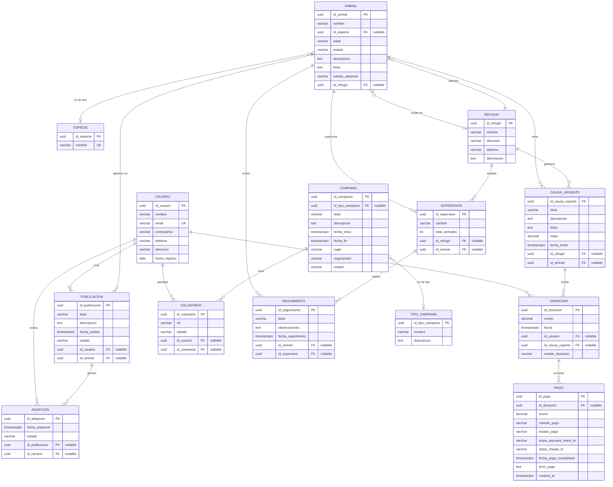

2<div align="center">
  <h1>🐾 Love4Pets</h1>
  <p><strong>Plataforma integral para la adopción, cuidado y protección de animales</strong></p>
  
  
  
  
  
  
  
  <br/>
  
  
  
  
</div>

---

## 📋 Tabla de Contenidos

- [Descripción](#-descripción)
- [Características](#-características)
- [Tecnologías](#️-tecnologías)
- [Requisitos Previos](#-requisitos-previos)
- [Instalación](#-instalación)
- [Configuración](#️-configuración)
- [Uso](#-uso)
- [API Documentation](#-api-documentation)
- [Estructura del Proyecto](#-estructura-del-proyecto)
- [Modelo de Datos](#-modelo-de-datos)
- [Próximos Pasos](#-próximos-pasos)
- [Scripts Disponibles](#-scripts-disponibles)
- [Contribuir](#-contribuir)

---

## 📖 Descripción

**Love4Pets** es una plataforma completa diseñada para facilitar la adopción de animales, gestionar refugios, coordinar campañas de voluntariado y recaudar fondos para causas urgentes relacionadas con el bienestar animal.

### 🎯 Objetivo

Conectar a personas que desean adoptar mascotas con refugios y animales que necesitan un hogar, mientras se facilita la gestión integral de refugios, el seguimiento de animales y la participación ciudadana a través de donaciones y voluntariado.

### 📊 Estado Actual del Proyecto

Este proyecto se encuentra en desarrollo activo como parte del **Taller 4** de la asignatura "Aplicación para el Servidor Web".

**Progreso de Implementación:**
- ✅ **9 de 14 módulos completados** (64%)
- ✅ **~45 endpoints REST** funcionando
- ✅ **Documentación Swagger** completa para módulos implementados
- ✅ **Base de datos SQLite** con TypeORM
- ✅ **Validación de datos** con class-validator
- ✅ **Arquitectura de 4 capas** (Entity, DTO, Service, Controller)

**Evaluación según Rúbrica Académica:**
- 📝 **Puntaje actual**: 22/24 puntos (EXCELENTE)
- 🎯 **Completitud de entidades**: 64% (9/14)
- ✅ **Arquitectura y documentación**: 100%

Para más detalles sobre el cumplimiento de requisitos, consulta [CUMPLIMIENTO_REQUISITOS.md](CUMPLIMIENTO_REQUISITOS.md).

---

## ✨ Características

### Estado de Implementación: 9/14 Módulos (64%)

### 👥 Gestión de Usuarios
- ✅ **Implementado**: CRUD completo de usuarios
- ✅ Registro con validación de email único
- ✅ Gestión de perfiles (nombre, email, teléfono, dirección)
- ✅ Fecha de registro automática

### 🐕 Gestión de Animales
- ✅ **Implementado**: CRUD completo de animales
- ✅ Registro completo (nombre, edad, estado, descripción, fotos)
- ✅ Clasificación por especies (relación con módulo Especie)
- ✅ Estados de adopción (disponible, en proceso, adoptado)
- ✅ Asignación a refugios
- ⏳ Sistema de seguimiento post-adopción (módulo Seguimiento pendiente)

### 🏠 Refugios
- ✅ **Implementado**: CRUD completo de refugios
- ✅ Gestión de múltiples refugios
- ✅ Información detallada (nombre, dirección, teléfono, descripción)
- ⏳ Asignación de supervisores (módulo Supervisor pendiente)

### 📢 Publicaciones y Adopciones
- ✅ **Implementado**: CRUD completo de publicaciones
- ✅ Publicación de animales disponibles
- ✅ Relación con Usuario y Animal
- ✅ **Implementado**: CRUD completo de adopciones
- ✅ Proceso de solicitud y seguimiento de adopción
- ✅ Estado de adopción

### 🎗️ Campañas y Voluntariado
- ✅ **Implementado**: CRUD completo de campañas
- ✅ Gestión de tipos de campaña (esterilización, vacunación, eventos)
- ✅ Programación con fechas de inicio/fin
- ✅ Información de lugar y organizador
- ✅ **Implementado**: CRUD completo de voluntarios
- ✅ Registro y asignación de voluntarios a campañas
- ✅ Gestión de roles y estados

### 💰 Donaciones y Causas Urgentes
- ⏳ Creación de causas urgentes (módulo CausaUrgente pendiente)
- ⏳ Sistema de donaciones con metas (módulo Donacion pendiente)
- ⏳ Integración con Stripe para pagos (módulo Pago pendiente)
- ⏳ Tracking de transacciones

### 📊 Seguimiento y Supervisión
- ⏳ Registro de observaciones veterinarias (módulo Seguimiento pendiente)
- ⏳ Historial médico completo
- ⏳ Asignación de supervisores a animales (módulo Supervisor pendiente)

---

## 🛠️ Tecnologías

### Backend
- **[NestJS](https://nestjs.com/)** - Framework progresivo de Node.js
- **[TypeScript](https://www.typescriptlang.org/)** - Superset tipado de JavaScript
- **[TypeORM](https://typeorm.io/)** - ORM para TypeScript y JavaScript
- **[SQLite](https://www.sqlite.org/)** - Base de datos SQL embebida

### Documentación
- **[Swagger](https://swagger.io/)** - Documentación interactiva de API

### Validación y Transformación
- **[class-validator](https://github.com/typestack/class-validator)** - Validación basada en decoradores
- **[class-transformer](https://github.com/typestack/class-transformer)** - Transformación de objetos

### Pagos
- **[Stripe](https://stripe.com/)** - Procesamiento de pagos (integración futura)

---

## 📦 Requisitos Previos

Antes de comenzar, asegúrate de tener instalado:

- **Node.js** >= 18.x
- **npm** >= 9.x o **yarn** >= 1.22.x
- **Git**

---

## 🚀 Instalación

### 1️⃣ Clonar el repositorio

```bash
git clone https://github.com/tu-usuario/love4pets.git
cd love4pets
```

### 2️⃣ Instalar dependencias

```bash
npm install
```

### 3️⃣ Configurar variables de entorno

Crea un archivo `.env` en la raíz del proyecto:

```bash
cp .env.example .env
```

Edita el archivo `.env` con tus configuraciones (ver sección [Configuración](#️-configuración)).

---

## ⚙️ Configuración

### Variables de Entorno

Crea un archivo `.env` con las siguientes variables:

```env
# Servidor
PORT=3000
NODE_ENV=development

# Base de Datos
DB_TYPE=sqlite
DB_DATABASE=tienda.sqlite

# Stripe (opcional, para pagos)
STRIPE_SECRET_KEY=sk_test_tu_clave_secreta
STRIPE_PUBLISHABLE_KEY=pk_test_tu_clave_publica
```

### Base de Datos

El proyecto usa **SQLite** por defecto. La base de datos se creará automáticamente al iniciar la aplicación.

Para usar otra base de datos (PostgreSQL, MySQL, etc.), modifica la configuración en `src/app.module.ts`:

```typescript
TypeOrmModule.forRoot({
  type: 'postgres', // o 'mysql', 'mariadb', etc.
  host: 'localhost',
  port: 5432,
  username: 'tu_usuario',
  password: 'tu_contraseña',
  database: 'love4pets',
  entities: [__dirname + '/**/*.entity{.ts,.js}'],
  synchronize: true, // ⚠️ Cambiar a false en producción
}),
```

---

## 🎮 Uso

### Modo Desarrollo

Inicia el servidor en modo desarrollo (con hot-reload):

```bash
npm run start:dev
```

El servidor estará disponible en: `http://localhost:3000`

### Modo Producción

1. **Compilar el proyecto:**

```bash
npm run build
```

2. **Iniciar el servidor:**

```bash
npm run start:prod
```

### Ejecutar Tests

```bash
# Tests unitarios
npm run test

# Tests e2e
npm run test:e2e

# Cobertura de tests
npm run test:cov
```

---

## 📚 API Documentation

### Swagger UI

Una vez que el servidor esté ejecutándose, accede a la documentación interactiva de la API:

🔗 **http://localhost:3000/api**

Aquí podrás:
- ✅ Ver todos los endpoints disponibles
- ✅ Probar las peticiones directamente
- ✅ Ver los esquemas de datos (DTOs)
- ✅ Consultar respuestas de ejemplo

### Endpoints Principales

#### ✅ Módulos Implementados

| Recurso | Método | Endpoint | Descripción |
|---------|--------|----------|-------------|
| **Usuarios** | GET | `/usuario` | Listar todos los usuarios |
| | GET | `/usuario/:id` | Obtener un usuario |
| | POST | `/usuario` | Crear usuario |
| | PATCH | `/usuario/:id` | Actualizar usuario |
| | DELETE | `/usuario/:id` | Eliminar usuario |
| **Especies** | GET | `/especie` | Listar todas las especies |
| | GET | `/especie/:id` | Obtener una especie |
| | POST | `/especie` | Crear especie |
| | PATCH | `/especie/:id` | Actualizar especie |
| | DELETE | `/especie/:id` | Eliminar especie |
| **Refugios** | GET | `/refugio` | Listar refugios |
| | GET | `/refugio/:id` | Obtener un refugio |
| | POST | `/refugio` | Crear refugio |
| | PATCH | `/refugio/:id` | Actualizar refugio |
| | DELETE | `/refugio/:id` | Eliminar refugio |
| **Animales** | GET | `/animal` | Listar animales |
| | GET | `/animal/:id` | Obtener un animal |
| | POST | `/animal` | Crear animal |
| | PATCH | `/animal/:id` | Actualizar animal |
| | DELETE | `/animal/:id` | Eliminar animal |
| **Publicaciones** | GET | `/publicacion` | Listar publicaciones |
| | GET | `/publicacion/:id` | Obtener una publicación |
| | POST | `/publicacion` | Crear publicación |
| | PATCH | `/publicacion/:id` | Actualizar publicación |
| | DELETE | `/publicacion/:id` | Eliminar publicación |
| **Adopciones** | GET | `/adopcion` | Listar adopciones |
| | GET | `/adopcion/:id` | Obtener una adopción |
| | POST | `/adopcion` | Crear adopción |
| | PATCH | `/adopcion/:id` | Actualizar adopción |
| | DELETE | `/adopcion/:id` | Eliminar adopción |
| **Campañas** | GET | `/campania` | Listar campañas |
| | GET | `/campania/:id` | Obtener una campaña |
| | POST | `/campania` | Crear campaña |
| | PATCH | `/campania/:id` | Actualizar campaña |
| | DELETE | `/campania/:id` | Eliminar campaña |
| **Tipos de Campaña** | GET | `/tipo-campania` | Listar tipos de campaña |
| | GET | `/tipo-campania/:id` | Obtener un tipo |
| | POST | `/tipo-campania` | Crear tipo |
| | PATCH | `/tipo-campania/:id` | Actualizar tipo |
| | DELETE | `/tipo-campania/:id` | Eliminar tipo |
| **Voluntarios** | GET | `/voluntario` | Listar voluntarios |
| | GET | `/voluntario/:id` | Obtener un voluntario |
| | POST | `/voluntario` | Crear voluntario |
| | PATCH | `/voluntario/:id` | Actualizar voluntario |
| | DELETE | `/voluntario/:id` | Eliminar voluntario |

#### ⏳ Módulos Pendientes

Los siguientes módulos están en el diagrama ER pero aún no implementados:
- 🔴 **Supervisor** - Gestión de supervisores de refugios
- 🔴 **Seguimiento** - Seguimiento veterinario de animales
- 🔴 **Causa Urgente** - Causas urgentes para donaciones
- 🔴 **Donación** - Sistema de donaciones
- 🔴 **Pago** - Procesamiento de pagos con Stripe

_Para ver la documentación completa de los módulos implementados, visita `/api` en tu navegador._

---

## 📁 Estructura del Proyecto

```
love4pets/
├── src/
│   ├── app.module.ts           # Módulo principal de la aplicación
│   ├── main.ts                 # Punto de entrada con Swagger
│   │
│   ├── usuario/                # ✅ Módulo de usuarios
│   │   ├── dto/
│   │   │   ├── create-usuario.dto.ts
│   │   │   └── update-usuario.dto.ts
│   │   ├── entities/
│   │   │   └── usuario.entity.ts
│   │   ├── usuario.controller.ts
│   │   ├── usuario.service.ts
│   │   └── usuario.module.ts
│   │
│   ├── especie/                # ✅ Módulo de especies
│   │   ├── dto/
│   │   ├── entities/
│   │   ├── especie.controller.ts
│   │   ├── especie.service.ts
│   │   └── especie.module.ts
│   │
│   ├── refugio/                # ✅ Módulo de refugios
│   │   ├── dto/
│   │   ├── entities/
│   │   ├── refugio.controller.ts
│   │   ├── refugio.service.ts
│   │   └── refugio.module.ts
│   │
│   ├── animal/                 # ✅ Módulo de animales
│   │   ├── dto/
│   │   ├── entities/
│   │   ├── animal.controller.ts
│   │   ├── animal.service.ts
│   │   └── animal.module.ts
│   │
│   ├── publicacion/            # ✅ Módulo de publicaciones
│   │   ├── dto/
│   │   ├── entities/
│   │   ├── publicacion.controller.ts
│   │   ├── publicacion.service.ts
│   │   └── publicacion.module.ts
│   │
│   ├── adopcion/               # ✅ Módulo de adopciones
│   │   ├── dto/
│   │   ├── entities/
│   │   ├── adopcion.controller.ts
│   │   ├── adopcion.service.ts
│   │   └── adopcion.module.ts
│   │
│   ├── campania/               # ✅ Módulo de campañas
│   │   ├── dto/
│   │   ├── entities/
│   │   ├── campania.controller.ts
│   │   ├── campania.service.ts
│   │   └── campania.module.ts
│   │
│   ├── tipo-campania/          # ✅ Módulo de tipos de campaña
│   │   ├── dto/
│   │   ├── entities/
│   │   ├── tipo-campania.controller.ts
│   │   ├── tipo-campania.service.ts
│   │   └── tipo-campania.module.ts
│   │
│   └── voluntario/             # ✅ Módulo de voluntarios
│       ├── dto/
│       ├── entities/
│       ├── voluntario.controller.ts
│       ├── voluntario.service.ts
│       └── voluntario.module.ts
│
├── dist/                       # Código compilado
├── node_modules/               # Dependencias
├── test/                       # Tests e2e
│
├── tienda.sqlite               # Base de datos SQLite
├── .env                        # Variables de entorno (no versionado)
├── .env.example                # Ejemplo de variables de entorno
├── .gitignore                  # Archivos ignorados por Git
├── .prettierrc                 # Configuración de Prettier
├── eslint.config.mjs           # Configuración de ESLint
├── nest-cli.json               # Configuración del CLI de Nest
├── package.json                # Dependencias y scripts
├── tsconfig.json               # Configuración de TypeScript
├── tsconfig.build.json         # Configuración de build
├── CONTRIBUTING.md             # Guía de contribución
├── CUMPLIMIENTO_REQUISITOS.md  # Análisis de requisitos del taller
└── README.md                   # Este archivo
```

### ⏳ Módulos Pendientes de Implementación

Los siguientes módulos aparecen en el diagrama ER pero aún no están implementados:
- `supervisor/` - Gestión de supervisores
- `seguimiento/` - Seguimiento veterinario
- `causa-urgente/` - Causas urgentes
- `donacion/` - Donaciones
- `pago/` - Procesamiento de pagos

---

## 🗄️ Modelo de Datos

### Diagrama Entidad-Relación

El siguiente diagrama muestra la estructura completa de la base de datos del proyecto Love4Pets:



### Entidades Principales

#### ✅ Implementadas

#### 👤 Usuario
Representa a los usuarios de la plataforma (adoptantes, donantes, voluntarios).
- **Campos**: id_usuario (UUID), nombre, email (único), contraseña, teléfono, dirección, fecha_registro
- **Relaciones**: Adopciones, Publicaciones, Voluntariado, Donaciones

#### 🐾 Animal
Información completa de cada animal (perfil, estado, refugio).
- **Campos**: id_animal (UUID), nombre, edad, estado, descripción, fotos, estado_adopcion
- **Relaciones**: Especie, Refugio, Publicaciones

#### 🦴 Especie
Catálogo de especies de animales (Perro, Gato, Conejo, etc.).
- **Campos**: id_especie (UUID), nombre (único)
- **Relaciones**: Animales

#### 🏠 Refugio
Organizaciones que albergan animales.
- **Campos**: id_refugio (UUID), nombre, dirección, teléfono, descripción
- **Relaciones**: Animales, Supervisores, Causas Urgentes

#### 📝 Publicación
Publicaciones de animales disponibles para adopción.
- **Campos**: id_publicacion (UUID), título, descripción, fecha_subida, estado
- **Relaciones**: Usuario, Animal, Adopciones

#### 🤝 Adopción
Registro del proceso y estado de adopciones.
- **Campos**: id_adopcion (UUID), fecha_adopcion, estado
- **Relaciones**: Publicación, Usuario

#### 🎗️ Campaña
Eventos y campañas (esterilización, vacunación, etc.).
- **Campos**: id_campania (UUID), título, descripción, fecha_inicio, fecha_fin, lugar, organizador, estado
- **Relaciones**: Tipo de Campaña, Voluntarios

#### 📋 Tipo de Campaña
Catálogo de tipos de campaña (Esterilización, Vacunación, Adopción, etc.).
- **Campos**: id_tipo_campania (UUID), nombre, descripción
- **Relaciones**: Campañas

#### 🙋 Voluntario
Personas que participan en campañas.
- **Campos**: id_voluntario (UUID), rol, estado
- **Relaciones**: Usuario, Campaña

#### ⏳ Pendientes de Implementación

#### 👨‍⚕️ Supervisor
Supervisores que gestionan animales en refugios.
- **Estado**: 🔴 No implementado
- **Campos**: id_supervisor (UUID), nombre, total_animales
- **Relaciones**: Refugio, Animal, Seguimientos

#### 📊 Seguimiento
Registro de observaciones y seguimiento veterinario.
- **Estado**: 🔴 No implementado
- **Campos**: id_seguimiento (UUID), título, observaciones, fecha_seguimiento
- **Relaciones**: Animal, Supervisor

#### 🚨 Causa Urgente
Situaciones que requieren donaciones inmediatas.
- **Estado**: 🔴 No implementado
- **Campos**: id_causa_urgente (UUID), título, descripción, fotos, meta, fecha_limite
- **Relaciones**: Refugio, Animal, Donaciones

#### 💵 Donación
Registro de donaciones realizadas.
- **Estado**: 🔴 No implementado
- **Campos**: id_donacion (UUID), monto, fecha, estado_donacion
- **Relaciones**: Usuario, Causa Urgente, Pago

#### 💳 Pago
Transacciones procesadas a través de Stripe.
- **Estado**: 🔴 No implementado
- **Campos**: id_pago (UUID), monto, metodo_pago, estado_pago, stripe_payment_intent_id, stripe_charge_id, fecha_pago_completado
- **Relaciones**: Donación

---

## � Próximos Pasos

Para completar el 100% del proyecto, se deben implementar los siguientes módulos:

### Pendientes (5 módulos)

1. **Supervisor** ⏳
   - Gestión de supervisores de refugios
   - Relaciones con Refugio y Animal
   - Tiempo estimado: 25 minutos

2. **Seguimiento** ⏳
   - Seguimiento veterinario de animales
   - Registro de observaciones médicas
   - Relaciones con Animal y Supervisor
   - Tiempo estimado: 30 minutos

3. **Causa Urgente** ⏳
   - Gestión de causas urgentes
   - Metas de donación y plazos
   - Relaciones con Refugio y Animal
   - Tiempo estimado: 30 minutos

4. **Donación** ⏳
   - Sistema de donaciones
   - Estado y seguimiento de donaciones
   - Relaciones con Usuario y Causa Urgente
   - Tiempo estimado: 25 minutos

5. **Pago** ⏳
   - Procesamiento de pagos
   - Integración con Stripe
   - Relación con Donación
   - Tiempo estimado: 40 minutos (incluye integración Stripe)

**Tiempo total estimado**: 2.5 - 3 horas

### Mejoras Opcionales

- [ ] API versioning (`/api/v1`)
- [ ] Tests unitarios para servicios
- [ ] Tests e2e para endpoints
- [ ] Autenticación JWT
- [ ] Roles y permisos
- [ ] Paginación en listados
- [ ] Filtros de búsqueda avanzados
- [ ] Subida de imágenes a S3/Cloudinary

---

## �📜 Scripts Disponibles

```bash
# Desarrollo
npm run start          # Iniciar servidor
npm run start:dev      # Iniciar con hot-reload
npm run start:debug    # Iniciar con debugger

# Build
npm run build          # Compilar proyecto

# Producción
npm run start:prod     # Iniciar servidor de producción

# Calidad de Código
npm run format         # Formatear código con Prettier
npm run lint           # Ejecutar ESLint

# Testing
npm run test           # Tests unitarios
npm run test:watch     # Tests en modo watch
npm run test:cov       # Generar reporte de cobertura
npm run test:debug     # Tests con debugger
npm run test:e2e       # Tests end-to-end
```

---

## 🤝 Contribuir

¡Las contribuciones son bienvenidas! Si deseas contribuir al proyecto:

1. **Fork** el proyecto
2. Crea una **rama** para tu feature (`git checkout -b feature/AmazingFeature`)
3. **Commit** tus cambios (`git commit -m 'Add some AmazingFeature'`)
4. **Push** a la rama (`git push origin feature/AmazingFeature`)
5. Abre un **Pull Request**

### Guía de Estilo

- Usa **TypeScript** para todo el código
- Sigue las convenciones de **NestJS**
- Escribe **tests** para nuevas funcionalidades
- Documenta con **comentarios JSDoc** cuando sea necesario
- Usa **commits semánticos**: `feat:`, `fix:`, `docs:`, `refactor:`, etc.

---

## 📄 Licencia

Este proyecto está bajo la Licencia **UNLICENSED** - ver el archivo `package.json` para más detalles.

---

## 👨‍💻 Información del Proyecto

- **Asignatura**: Aplicación para el Servidor Web
- **Taller**: Taller 4 - API RESTful con NestJS y TypeORM
- **Tecnologías**: NestJS 11, TypeORM, SQLite, Swagger
- **Documentación**: [CUMPLIMIENTO_REQUISITOS.md](CUMPLIMIENTO_REQUISITOS.md)

---

## 🙏 Agradecimientos

- A todos los refugios y organizaciones que trabajan por el bienestar animal
- A la comunidad de NestJS por el excelente framework
- A todos los contribuidores del proyecto

---

<div align="center">
  <p>Hecho con ❤️ para los animales</p>
  <p>🐕 🐈 🐦 🐰 🐹</p>
  
  <br/>
  
  <p><em>Proyecto académico - Ingeniería de Software</em></p>
  <p><strong>Estado: En Desarrollo Activo (64% completado)</strong></p>
</div>
